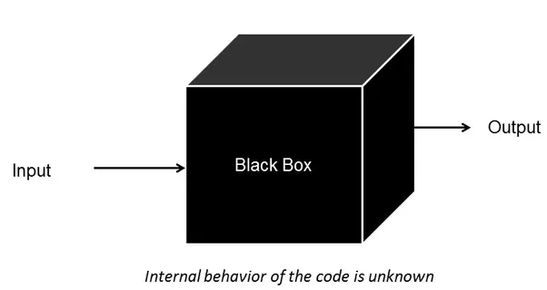
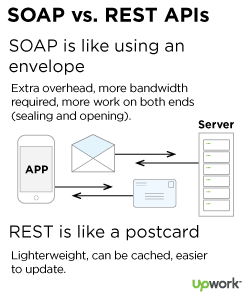
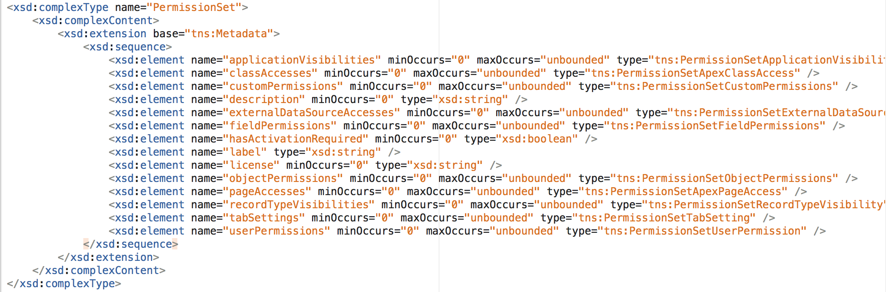
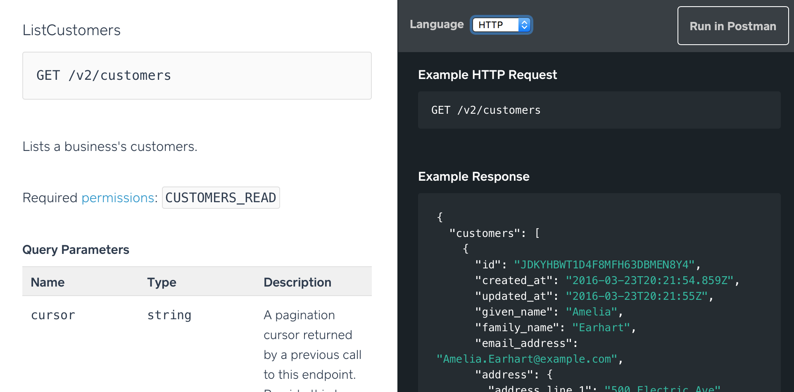

```{r setup, include=FALSE}
knitr::opts_chunk$set(echo = TRUE, cache = FALSE)
```

# Background


## What is an API

An <u><b>A</b></u>pplication <u><b>P</b></u>rogramming <u><b>I</b></u>nterface is 
just an abstraction from a lower level process. Think of this as a black box where 
you just need to provide some formatted input and you'll get back some formatted 
output without any need to understand how things are being done. 



Today, we'll be discussing web-based data APIs. They abstract away the data being 
stored in a database, so that you can access the data without getting access to the 
database and writing ad-hoc queries. Web-based data APIs come in two flavors (SOAP 
and REST), which we'll discuss next.



## What makes a SOAP API?

SOAP stands for <u><b>S</b></u>imple <u><b>O</b></u>bject <u><b>A</b></u>ccess <u><b>P</b></u>rotocol.  

It turns out that SOAP APIs can function on multiple computer protocols (HTTP, SMTP, TCP, or JMS). This 
means that it doesn't need to function over the web. That is just one easy way to transmit 
information to people.

SOAP APIs are almost always XML (eXtensible Markup Language) where the instructions for 
using the API is provided in a WSDL (Web Service Description Language). Below is a snapshot 
of the Salesforce API and how it defines a "PermissionSet" object. 



Resources:

 - [The Difference Between SOAP and REST](http://spf13.com/post/soap-vs-rest)
 - [SOAP vs REST Challenges](http://www.soapui.org/testing-dojo/world-of-api-testing/soap-vs--rest-challenges.html)

## What makes a REST API?

REST stands for <u><b>RE</b></u>presentational <u><b>S</b></u>tate <u><b>T</b></u>ransfer.  

REST uses the Noun?-Verb Paradigm where operations map exactly to HTTP protocol actions like 
`GET`, `POST`, `PUT`, and `DELETE`.

REST APIs are almost always JSON (Javascript Object Notation) where the instructions are 
provided on a web document (typically Swagger UI style) that you can read and format. 
The data types are not as strict as a SOAP API. Below is a snapshot of the Square API. 
You can see that it's much simpler to read than the Salesforce SOAP API shown above.



## Working with XML and JSON

It is important to know whether the API is SOAP or REST because, as mentioned, they 
are linked to processing and returning either XML or JSON. Unfortunately, in R there 
are a number of competing packages to dealing with each format. I recommend trying 
the `xml2` and `jsonlite` packages first. These are both part of the tidyverse. However, 
sometimes you may find that the `XML`, `rjson`, or `RJSONIO` packages provide unique 
functionality that is better for your case.

Let's see a tangible example of these two formats. First, imagine that you are working 
with customer data. Here is what a single customer record might look like from each API.

*XML*
```{r xml-record-example, echo=FALSE}
XML::newXMLNode("customer",
                XML::newXMLNode("first_name", "Rick"),
                XML::newXMLNode("last_name", "James"),
                XML::newXMLNode("occupation", "funk legend")
                )
```

*JSON*
```{r json-record-example, echo=FALSE}
cust_record <- list(customer=list(first_name="Rick", 
                                  last_name="James", 
                                  occupation="funk legend"))
cat(jsonlite::toJSON(a, pretty=T, auto_unbox=TRUE))
```

# Getting started in R

Above we mentioned two packages `xml2` and `jsonlite`. These packages will parse 
the API data from XML or JSON to a `list` or `data.frame`; however, we must be able 
to communicate with the server to even get the data. This HTTP communication can be 
done using the `httr` package. Along with the `httr` package it is helpful to load the 
rest of the tidyverse which contains the `dplyr`, `tidyr`, and `purrr` packages that 
will aid in further processing the data into a tidy format.

```{r load-packages, warning=FALSE, message=FALSE}
library(xml2)
library(jsonlite)
library(httr)
library(tidyverse)
```

## How to authenticate to an API

APIs almost always require authenticating. They protect data and the creators want 
to be able to track and limit requests accordingly. There are 3 common types of 
authentication: 

 1. Basic Authentication: You send over your username and password
 2. Key-Based Authentication: You send over a long key or token in the URL or the Header
 3. OAuth 2.0 Authentication: You authorize a client to interact with your level of permissions

*Basic Authentication*
```{r basic-auth, eval=FALSE}
response <- GET("http://httpbin.org/basic-auth/user/passwd", 
                authenticate("user", "passwd"))
content(response, 'parsed')
```
https://swagger.io/docs/specification/authentication/basic-authentication/

*API Key Authentication*
```{r api-key-auth, eval=FALSE}
# Square API list locations with authentication provided in the header
GET("https://connect.squareup.com/v2/locations", 
    add_headers(Authorization = sprintf("Bearer %s", "sq0atp-PQdK9iw65pOwQgTQXtQt6Q")))

# Open Movie Database movie search by title with the authentication provided in the URL
GET(paste0('https://www.omdbapi.com/',
           '?t=The+Godfather&plot=short&apikey=4439909d'))
```

Note: Username/Password and Key-based authentication is only considered secure if 
used together with other security mechanisms such as HTTPS/SSL. Otherwise, people 
who snoop and grab your internet traffic could see in plain-text what your credentials are 
and then turn around and use themselves.

https://swagger.io/docs/specification/authentication/api-keys/

*OAuth 2.0 Authentication* 

This is the most complex and secure method of authentication. It consists of multiple 
parts, namely: 

 - `Authorization URL` - where to send your initial request
 - `Token URL` - where you get your token initially
 - `Refresh URL` - where to get a new token after this one expires
 - `Scopes` - a list of resources that the client can access given the supplied credentials
 
Fortunately, R takes care of all this as long as you create a "client" in R. 

```{r oauth2-auth, eval=FALSE}
sq_oauth_app <- oauth_app("square",
                          key = app_id, 
                          secret = app_secret,
                          redirect_uri = callback_url)
sq_oauth_endpoints <- oauth_endpoint(request = NULL,
                                     base_url = sprintf("%s/oauth2", "https://connect.squareup.com"),
                                     authorize = "authorize", access = "token", revoke = "revoke")
sq_token <- oauth2.0_token(endpoint = sq_oauth_endpoints,
                           app = sq_oauth_app, 
                           cache = cache)

GET("https://connect.squareup.com/v2/locations", 
    config(token = sq_token))
```

## Keeping your credentials hidden in .Rprofile

In the API Key Authentication example above, I put my token in the script. This 
is not really secure. Anybody with the script can now pretend to be me. As an alternative, 
you can setup R to store your passwords and other sensitive information outside of the 
script so they can stay hidden.

Straight from the R manual: 

> R searches for a user profile, a file of R code. The path of this file can be 
> specified by the R_PROFILE_USER environment variable (and tilde expansion will 
> be performed). If this is unset, a file called ‘.Rprofile’ is searched for in 
> the current directory or in the user's home directory (in that order). The user 
> profile file is sourced into the workspace.

```{r checking-home-directory}
# create the .Rprofile file at this location if it doesn't already exist
Sys.getenv("HOME")
```

### Enabling the Viewing of Hidden Files

To view the file you may need to enable "Hidden Files" in your File Explorer (Windows) or 
Finder (Mac). To do this on Mac you need to open up the terminal and type: 

```
defaults write com.apple.finder AppleShowAllFiles YES
```

Finally relaunch Finder by using holding the Option key, then right clicking on the 
Finder icon in the dock and click Relaunch.

### Adding your credentials to .Rprofile

Open up .Rprofile, add the following lines, and save it.

```
options(scipen=99, stringsAsFactors=FALSE)
Sys.setenv(SQUARE_PAT = "sq0atp-PQdK9iw65pOwQgTQXtQt6Q")
```
*NOTE*: Ensure that there is a new line at the end of your file so that the 
second command runs!

### Checking your .Rprofile settings

Now that you've saved your token in you'll need to restart R. This is because R 
reads the `.Rprofile` everytime you start R, so the restart forces the file to be 
loaded again. You can restart R by going to `Session -> Restart R` or using the 
shortcut CMD+SHIFT+F10 (CRTL+SHIFT+F10 on Windows). You can check that the token 
now exists by running: 

```{r check-token}
Sys.getenv('SQUARE_PAT')
```

## Becoming familiar with HTTP status codes

Before you get started making API calls, it is important to understand various messages 
that the API will return. HTTP status codes follow a pattern so that, at a glance, 
understand where the error happened. After that there is usually an "error code" and 
"error reason" that more fully describes why that error occurred. Here are the ranges 
of codes and what they mean:

 - 2XX: Success!
 - 4XX: Your fault!
 - 5XX: Their fault!

Here is an example where I wasn't authenticated before making the API call. It's 
a 401 error, that's my fault.

```{r no-password-error}
response <- GET("https://connect.squareup.com/v2/locations")
response
content(response)

# here is the right way to provide the authenticated call
# GET("https://connect.squareup.com/v2/locations", 
#                add_headers(Authorization = sprintf("Bearer %s", "sq0atp-PQdK9iw65pOwQgTQXtQt6Q")))
```

Here is an example where I didn't get the URL correct. I forgot to include the "s" 
to spell "locations" not "location" as the endpoint.

 ```{r wrong-url}
response <- GET("https://connect.squareup.com/v2/location")
response
content(response)
```

There are about 40 status codes. Here are tips on how to handle the most common codes you'll see:

 - 200: Success: Jump for joy, everything was processed successfully
 - 401: Unauthenticated: Make sure you're sending your password or token correctly
 - 404: Not Found: Make sure the URL you're sending to is the right one
 - 500: Server Error: Double check you're formatting the request correctly

## The anatomy of an API call (scheme, path, query, and body)

Every API call can be broken down into a few different elements. See this example 
where we can create a new customer record 

 - *Scheme*: http or https
 - *Path*: connect.squareup.com/v2/customers
 - *Query*: ?key1=value1&key2=value2
 - *Body*: `{'given_name'='Bob', 'family_name'='Miller', 'note'='API Test'}"`

Putting his all together you want to make a request like this:
```
POST https://connect.squareup.com/v2/customers
{
  "given_name": "Bob",
  "family_name": "Miller",
  "note": "API Test"
}
```

Here is how to replicate that from R: 

```{r example-POST, eval=FALSE}
response <- POST('https://connect.squareup.com/v2/customers', 
                 add_headers(Authorization = sprintf("Bearer %s", "sq0atp-PQdK9iw65pOwQgTQXtQt6Q")),
                 body = list(given_name='Bob', 
                             family_name='Miller', 
                             note='API Test'), 
                 encode='json')
status_code(response)
content(response, 'parsed')
```

In this example we didn't show how the "query" component fits in. A query is information 
added at the end of the "path" component to control the behavior. It's always represented 
as a series of key, value pairs after a question mark in the URL. Here is an example where 
we 

```{r example-with-query-param, eval=FALSE}
response <- GET('https://connect.squareup.com/v2/customers', 
                add_headers(Authorization = sprintf("Bearer %s", "sq0atp-PQdK9iw65pOwQgTQXtQt6Q")),
                query=
                 
status_code(response)
content(response, 'parsed')
```

## HTTP verbs (GET, POST, PUT, PATCH, DELETE)

In the last example you saw that I used two different functions, the `POST()` function and 
then the `GET()` function. This is because I wanted to do different types of things. 
In the first example I wanted to "post" the new customer data to the API server. In the 
second, I wanted to "get" the customer data.

The takeaway is always keep in mind what type of operation you are trying to do. If you are trying 
to create or update a record, you most likely won't be using the `GET()` function. This 
is an error that can sometimes be hard to debug and is easy to avoid.

Verb | Behavior | Has Body?
-----|----------|:---------:
GET | Read Data | ✗
POST | Create/Read Data | ✓
PUT/PATCH | Update Data | ✓
DELETE | Delete Data | ✗

Below is a screenshot of the API documentation where they make it very clear what 
type of HTTP request you should be using against that endpoint.

[IMAGE FROM API]

# Using the Square APIs (Connect v1 & v2)

Square has developed two different APIs (v1 & v2) that are organized to have endpoints 
that each serve a different type of data. For examples, a URL for customers (), a URL for 
payments(), a URL for products(). This way you can easily find the type of data you're looking for. 

## The role of locations in the Square API

The Square API stores a lot of information. It's likely that they have a database 
that is "partitioned" by location so that whenever a new request comes in they can 
quickly pull the data by navigating directly to that partion and then pulling the data 
based on the request. You'll see that certain endpoints require you to specify the location. 
Here is an example for the transactions: 

`kljsdfklj`

So how do you get the location IDs? Use the `ListLocations` endpoint. Here is how to 
gather the information for every location: 

```{r list-locations}

```

## Pulling transactions

Now that we know The Corner location has ID `sdflksjd` we can use it to pull all 
the recent transactions. 

```{r list-corner-transactions}
```

## Pulling order itemizations

In the example above we saw that the transaction data only provides the gross revenue 
for the transaction and the customer ID. If we want to know more about each customer 
order, then we need to use the `Payments` endpoint.

```{r payments-example}
```

## Using the squareupr package

Pulling API data in R is definitely a time consuming process. You have to check the 
documentation, fiddle with the R code to reproduce the HTTP call, then parse the output 
into a tidy format. For this reason, R users typically create packages that simplify 
your workflow and cut out all the processing and guesswork. This is the reason for 
creating the `squareupr` package.

When using the package, pulling transaction data is like this

```{r squareupr-list-transactions}
```

Or pulling customers from the last 90 days can be done like this
```{r squareupr-list-customers}
```

And if you'd like to get the assigned groups there is a function called `sq_extract_cust_groups()` 
to do that. 

```{r squareupr-extract-cust-groups}
#sq_extcustgroups_
```

## The performance of the API

It takes X minutes to get a month's worth of transaction data, then it takes another 
X minutes to get the payment data to breakdown each transaction's items. You can 
see that the time starts to become a barrier to actually doing data analysis. For 
this reason we've started pulling down the API data and using that instead of using 
the API directly. All of that data is being stored HERE. 

[INSERT LINK]

## Next steps

Our analyses of Square data will require further routines. Every step towards making 
a data flow reproducible and tidy will reduce mistakes and the time to analyze later. So 
if you come up with a function to do something useful consider adding it to the package 
or our library to leverage again later. 
